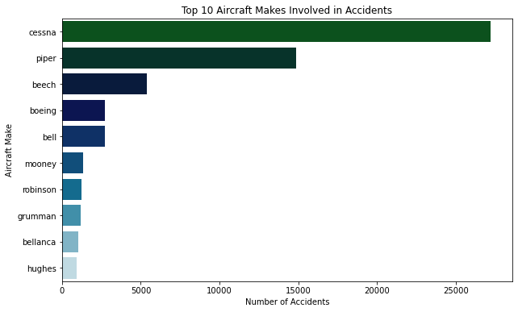
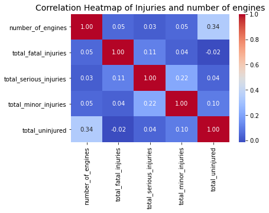
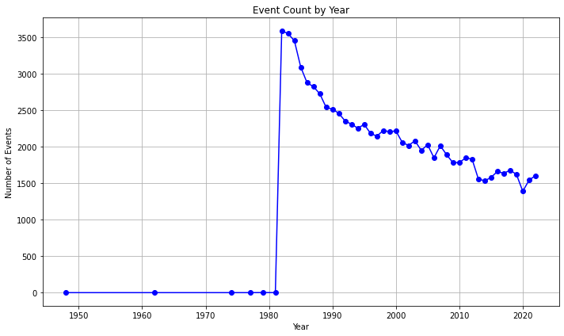
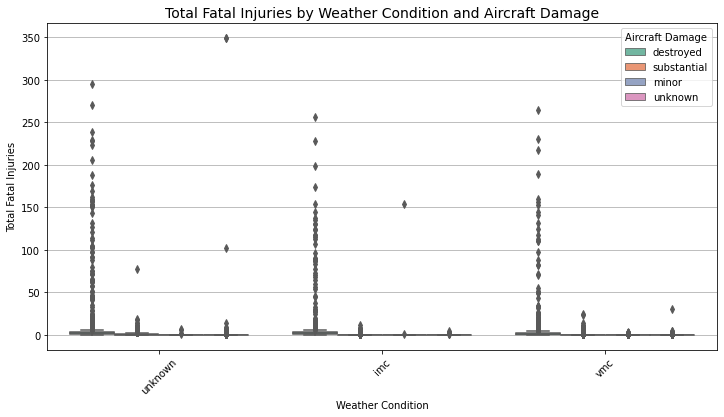

# Aviation Risk Analysis Project

## 📊 Business Understanding

### Project Overview
As the company explores entry into the aviation industry, this project uses aviation accident data from the National Transportation Safety Board (1962–2023) to identify strategic opportunities and risk factors. (https://www.kaggle.com/datasets/khsamaha/aviation-accident-database-synopses). By analyzing trends, causes, and survivability of aviation incidents, we aim to identify low-risk aircrafts to buy and guide data-informed decisions.
### Business Objective and Understanding
Provide actionable insights to support aircraft purchase decisions that minimize operational risk. These insights will assist internal stakeholders, investors, and insurers in evaluating the safety profiles of aircraft types and aviation sectors.

## ❓ Key Business Questions
This analysis is guided by the following questions:

1. Which aircraft makes are least involved in accidents?
    Helps prioritize safer manufacturers and assess amateur-built risks.
2. What are the most common causes of accidents?
    Informs safety trends, age/model comparisons.
3. What factors affect accident survivability?
    Investigates impact of weather, engine types, and other conditions.
4. How do accident rates differ between commercial and private operators?
    Supports strategic entry into the most stable sector.
5. Are there seasonal patterns in accidents?
    Aids in weather contingency and planning.
6. What factors contribute most to fatal accidents?
    Guides aircraft specification requirements and safety features.

## 📂 Data Understanding

In this section, we explore the dataset to understand its structure, contents, and quality. The dataset includes over six decades of aviation accident records, so it’s important to assess its usability before analysis.
We examine:Column types and descriptions,
Missing data patterns,
Categorical variables and grouping,
Temporal and geographic coverage,
Data completeness, consistency, and uniqueness.
This initial assessment helps identify potential challenges and guides how we prepare the data for accurate and meaningful analysis.

Most accidents occur in VMC (good weather) compared to bad weather

Highest accident counts are in personal, instructional and business aviation

A few well known manufacturers dominate accident reports, which may be a reflection of high market share as opposed to poor safety records

Positive correlation (0.53) between serious injuries and fatalities, meaning accidents with serious injuries are more likely to also have fatalities.

There are seasonal patterns in aviation accidents. Understanding and adapting to seasonal patterns directly contributes to lower operational risk, improved safety records, and higher profitability.

Minor or no damage cases rarely lead to fatal imjuries regardless of weather

## Recommendations
1. To avert weather related risks, we should invest in aircrafts that are suitable for both VMC(good weather) and IMC(bad weather)
- Pilots should be trained on how to operate especially during IMC

2. Based on Aircraft make, it's safer to invest in newer models from established manufacturers with strong safety records and active support such as Cessna and Beechcraft.

3.  For low risks, commercial operations offer safety due to strict regulations and operational standards.Pilot experience and maintenance may be the reason as to why personal and instructional aviation has a higher risk

4. Large multi-engine aircraft don't eliminate risk but may be beneficial when combined with other factors (weather, operator type). Focus should be on operator practices, training, and flight conditions rather than only the aircraft’s physical specifications.

5. Focus on advanced weather-avoidance technologies and pilot training for IMC conditions, as weather paired with severe aircraft damage significantly increases fatalities.